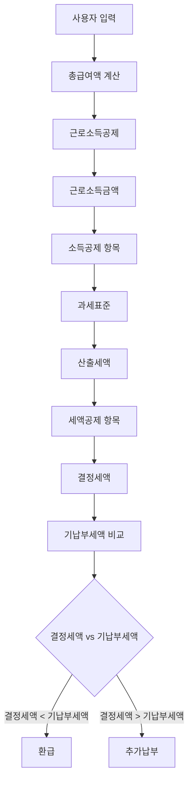

# Calculator 페이지 계산 결과 섹션

## 📋 목차
1. [계산 플로우](#계산-플로우)
2. [입력 항목](#입력-항목)
3. [계산식 상세](#계산식-상세)
4. [결과 출력](#결과-출력)

---

## 계산 플로우



### 세부 플로우 설명

| 단계 | 항목 | 설명 |
|------|------|------|
| 1 | 총급여액 | 연봉 - 비과세소득(식대, 보육수당 등) |
| 2 | 근로소득공제 | 급여구간별 공제율 적용 |
| 3 | 근로소득금액 | 총급여액 - 근로소득공제 |
| 4 | 소득공제 | 인적공제, 카드공제, 주택자금 등 |
| 5 | 과세표준 | 근로소득금액 - 소득공제 합계 |
| 6 | 산출세액 | 과세표준에 세율 적용 |
| 7 | 세액공제 | 의료비, 교육비, 연금계좌, 기부금 등 |
| 8 | 결정세액 | 산출세액 - 세액공제 합계 |
| 9 | 환급/추가납부 | 기납부세액 - 결정세액 |

---

## 입력 항목

### 1. 총급여 섹션
| 항목 | 변수명 | 설명 |
|------|--------|------|
| 연봉 | `annualSalary` | 급여 + 상여 총액 |
| 비과세 식대 | `mealAllowance` | 월 20만원 × 12개월 한도 |
| 6세 이하 자녀 | `childrenUnder6` | 보육수당 비과세 적용 |
| 기납부세액 | `withheldTax` | 원천징수된 세액 |

### 2. 기본공제 섹션
| 항목 | 변수명 | 공제금액 |
|------|--------|----------|
| 본인 | - | 150만원 (자동) |
| 배우자 | `spouse` | 150만원 |
| 직계존속 | `parents` | 150만원/인 |
| 자녀 | `children` | 150만원/인 |
| 형제자매 | `siblings` | 150만원/인 |
| 위탁아동 | `foster` | 150만원/인 |
| 기초수급자 | `recipient` | 150만원/인 |

### 3. 4대보험 섹션
| 항목 | 변수명 | 공제 방식 |
|------|--------|-----------|
| 국민연금 | `nationalPension` | 전액 소득공제 |
| 건강보험 | `healthInsurance` | 전액 소득공제 |
| 장기요양 | `longTermCare` | 전액 소득공제 |
| 고용보험 | `employmentInsurance` | 전액 소득공제 |

### 4. 신용카드 등 사용액 섹션
| 항목 | 변수명 | 공제율 |
|------|--------|--------|
| 신용카드 | `creditCard` | 15% |
| 체크카드 | `debitCard` | 30% |
| 현금영수증 | `cash` | 30% |
| 전통시장 | `traditionalMarket` | 40% |
| 대중교통 | `publicTransport` | 80% |
| 문화체육 | `culture` | 30% |

### 5. 의료비 섹션
| 항목 | 변수명 | 공제율 |
|------|--------|--------|
| 난임시술비 | `infertility` | 30% |
| 미숙아/선천성이상아 | `premature` | 20% |
| 본인/장애인/65세이상 | `selfDisabledSenior` | 15% (한도없음) |
| 그 밖의 부양가족 | `otherFamily` | 15% (700만원 한도) |

### 6. 교육비 섹션
| 항목 | 변수명 | 한도 |
|------|--------|------|
| 본인 | `selfEducation` | 한도 없음 |
| 미취학 자녀 | `preschool` | 300만원/인 |
| 초중고 | `elementary` | 300만원/인 |
| 대학 | `university` | 900만원/인 |

### 7. 주택자금 섹션
| 항목 | 변수명 | 공제 방식 | 조건 |
|------|--------|-----------|------|
| 주택청약저축 | `housingSubscription` | 40% 소득공제 (한도 300만원) | 총급여 7천만원 이하 |
| 주택임차차입금 | `rentLoanPayment` | 40% 소득공제 (한도 400만원) | - |
| 장기주택저당차입금 | `mortgageInterest` | 전액 소득공제 | 300~1,800만원 한도 |
| 월세 | `monthlyRent` | 세액공제 (15~17%) | 1,000만원 한도 |

### 8. 연금계좌·보험 섹션
| 항목 | 변수명 | 공제율 | 한도 |
|------|--------|--------|------|
| 연금저축 | `pensionSavings` | 13.2~16.5% | 600만원 |
| 퇴직연금(IRP) | `irp` | 13.2~16.5% | 합산 900만원 |
| ISA 전환금액 | `isaTransfer` | 13.2~16.5% | 별도 300만원 |
| 일반 보장성 보험 | `generalInsurance` | 12% | 100만원 |
| 장애인 전용 보험 | `disabledInsurance` | 15% | 100만원 |

### 9. 기부금 섹션
| 항목 | 변수명 | 공제율 | 한도 |
|------|--------|--------|------|
| 정치자금 | `politicalDonation` | 10만원 이하 100/110, 초과 15~25% | - |
| 고향사랑 | `hometownDonation` | 10만원 이하 100/110, 초과 15% | 2,000만원 |
| 고향사랑 특별재난 | `hometownDisaster` | 10만원 이하 100/110, 초과 30% | 합산 2,000만원 |
| 특례기부금 | `specialDonation` | 1천만원 이하 15%, 초과 30% | 소득 100% |
| 우리사주조합 | `employeeDonation` | 1천만원 이하 15%, 초과 30% | 소득 30% |
| 일반기부금(종교외) | `designatedDonation` | 1천만원 이하 15%, 초과 30% | 소득 30% |
| 종교단체 | `religiousDonation` | 1천만원 이하 15%, 초과 30% | 소득 10% |

---

## 계산식 상세

### 1. 근로소득공제 (2026년 기준)

```javascript
function calculateIncomeDeduction(salary) {
    if (salary <= 5,000,000) {
        return salary × 70%
    } else if (salary <= 15,000,000) {
        return 3,500,000 + (salary - 5,000,000) × 40%
    } else if (salary <= 45,000,000) {
        return 7,500,000 + (salary - 15,000,000) × 15%
    } else if (salary <= 100,000,000) {
        return 12,000,000 + (salary - 45,000,000) × 5%
    } else {
        return 14,750,000 + (salary - 100,000,000) × 2%
    }
}
```

| 총급여 구간 | 공제액 계산 |
|-------------|-------------|
| 500만원 이하 | 총급여 × 70% |
| 500만원 ~ 1,500만원 | 350만원 + (총급여 - 500만원) × 40% |
| 1,500만원 ~ 4,500만원 | 750만원 + (총급여 - 1,500만원) × 15% |
| 4,500만원 ~ 1억원 | 1,200만원 + (총급여 - 4,500만원) × 5% |
| 1억원 초과 | 1,475만원 + (총급여 - 1억원) × 2% |

### 2. 산출세액 (2026년 세율)

```javascript
function calculateTax(taxableIncome) {
    if (taxableIncome <= 14,000,000) {
        return taxableIncome × 6%
    } else if (taxableIncome <= 50,000,000) {
        return 840,000 + (taxableIncome - 14,000,000) × 15%
    } else if (taxableIncome <= 88,000,000) {
        return 6,240,000 + (taxableIncome - 50,000,000) × 24%
    } else if (taxableIncome <= 150,000,000) {
        return 15,360,000 + (taxableIncome - 88,000,000) × 35%
    } else if (taxableIncome <= 300,000,000) {
        return 37,060,000 + (taxableIncome - 150,000,000) × 38%
    } else if (taxableIncome <= 500,000,000) {
        return 94,060,000 + (taxableIncome - 300,000,000) × 40%
    } else if (taxableIncome <= 1,000,000,000) {
        return 174,060,000 + (taxableIncome - 500,000,000) × 42%
    } else {
        return 384,060,000 + (taxableIncome - 1,000,000,000) × 45%
    }
}
```

| 과세표준 구간 | 세율 | 누진공제 |
|---------------|------|----------|
| 1,400만원 이하 | 6% | - |
| 1,400만원 ~ 5,000만원 | 15% | 126만원 |
| 5,000만원 ~ 8,800만원 | 24% | 576만원 |
| 8,800만원 ~ 1.5억원 | 35% | 1,544만원 |
| 1.5억원 ~ 3억원 | 38% | 1,994만원 |
| 3억원 ~ 5억원 | 40% | 2,594만원 |
| 5억원 ~ 10억원 | 42% | 3,594만원 |
| 10억원 초과 | 45% | 6,594만원 |

### 3. 신용카드 등 소득공제

```javascript
// 최소 사용금액 (총급여의 25%)
const minSpending = salary × 25%

// 초과 사용액
const excessSpending = 총사용액 - minSpending

// 공제액 계산 (사용유형별 공제율 적용)
const deduction = {
    신용카드: min(신용카드사용액, excessSpending) × 15%,
    체크카드: min(체크카드사용액, 남은초과액) × 30%,
    현금영수증: min(현금영수증액, 남은초과액) × 30%,
    전통시장: 전통시장사용액 × 40%,
    대중교통: 대중교통사용액 × 80%,
    문화체육: 문화체육사용액 × 30%
}

// 기본한도: 300만원 (총급여에 따라 200~300만원)
// 추가한도: 전통시장 100만원, 대중교통 100만원, 문화체육 100만원
```

### 4. 의료비 세액공제

```javascript
// 문턱금액 (총급여의 3%)
const threshold = salary × 3%

// 공제대상 의료비 = 총의료비 - 실손보험금 - 문턱금액
const eligibleMedical = Math.max(0, 총의료비 - 실손보험금 - threshold)

// 세액공제
const deduction = {
    난임시술비: 난임시술비 × 30%,           // 한도 없음
    미숙아: 미숙아의료비 × 20%,             // 한도 없음
    본인/장애인/65세이상: 해당의료비 × 15%, // 한도 없음
    그밖의부양가족: 해당의료비 × 15%        // 700만원 한도
}
```

### 5. 교육비 세액공제

```javascript
// 공제율: 15%
// 한도별 계산
const deduction = {
    본인: 본인교육비 × 15%,           // 한도 없음
    미취학: min(미취학, 3,000,000) × 15%,
    초중고: min(초중고, 3,000,000) × 15%,
    대학: min(대학, 9,000,000) × 15%
}
```

### 6. 주택자금 공제

```javascript
// 소득공제 (총급여 7천만원 이하 조건)
const housingDeduction = {
    주택청약: salary <= 70,000,000 ? min(납입액, 3,000,000) × 40% : 0,
    주택임차: min(상환액, 4,000,000) × 40%,  // 연간 공제 한도 400만원
    장기주택저당: 이자상환액                  // 전액 공제, 300~1,800만원 한도
}

// 세액공제
const monthlyRentCredit = min(월세액, 10,000,000) × (salary <= 55,000,000 ? 17% : 15%)
```

### 7. 연금계좌 세액공제

```javascript
// 공제율: 총급여 5,500만원 이하 16.5%, 초과 13.2%
const rate = salary <= 55,000,000 ? 16.5% : 13.2%

// 한도: 연금저축 600만원, IRP 합산 900만원, ISA 300만원(별도)
const pensionLimit = min(연금저축, 6,000,000)
const totalLimit = min(연금저축 + IRP, 9,000,000)
const isaLimit = min(ISA전환금액, 3,000,000)

// 세액공제
const pensionCredit = totalLimit × rate
const isaCredit = isaLimit × rate

// 보험료 세액공제 (별도)
const insuranceCredit = {
    일반보험: min(보험료, 1,000,000) × 12%,
    장애인보험: min(보험료, 1,000,000) × 15%
}
```

### 8. 기부금 세액공제

```javascript
// 정치자금
const politicalCredit = {
    base: min(기부금, 100,000) × (100/110),      // 10만원 이하
    mid: min(초과분, 30,000,000) × 15%,          // 3천만원 이하
    high: max(0, 기부금 - 30,100,000) × 25%      // 3천만원 초과
}

// 고향사랑 (2천만원 한도)
const hometownCredit = {
    base: min(기부금, 100,000) × (100/110),
    excess: (기부금 - 100,000) × 15%             // 일반
    // 또는 (기부금 - 100,000) × 30%             // 특별재난지역
}

// 일반 기부금 (1천만원 기준)
const generalCredit = {
    under10m: min(기부금, 10,000,000) × 15%,
    over10m: max(0, 기부금 - 10,000,000) × 30%
}
```

---

## 결과 출력

### 결과 패널 구성

```
┌─────────────────────────────┐
│      예상 환급액            │
│    +1,234,567원             │ ← 환급(+) 또는 추가납부(-)
├─────────────────────────────┤
│ 과세표준      00,000,000원  │
│ 산출세액       0,000,000원  │
│ 세액공제 합계  -000,000원   │
├─────────────────────────────┤
│ 결정세액       0,000,000원  │
│ 기납부세액     0,000,000원  │
└─────────────────────────────┘
```

### 공제 내역 상세

| 항목 | 설명 |
|------|------|
| 근로소득공제 | 급여구간별 자동 계산 |
| 인적공제 | 부양가족 × 150만원 |
| 신용카드 공제 | 최소사용액 초과분의 15~80% |
| 의료비 세액공제 | 총급여 3% 초과분의 15~30% |
| 교육비 세액공제 | 지출액의 15% |
| 주택자금 공제 | 소득공제 + 월세 세액공제 |
| 연금계좌 세액공제 | 납입액의 13.2~16.5% |

---

## 조건부 표시 규칙

### 0원 항목 숨기기
- 계산식 섹션에서 금액이 0원인 항목은 표시하지 않음
- 합계 섹션에서도 해당 항목의 세부 내역 숨김

### 급여 조건 표시
| 항목 | 조건 | 미충족 시 |
|------|------|-----------|
| 주택청약저축 | 총급여 ≤ 7천만원 | "총급여 7천만원 초과로 공제 제외" (빨간색) |
| 월세 세액공제율 | 총급여 ≤ 5,500만원 | 17% → 15% |
| 연금계좌 공제율 | 총급여 ≤ 5,500만원 | 16.5% → 13.2% |

---

## 참고 사항

> ⚠️ **주의**: 이 결과는 시뮬레이션 값이며, 실제 국세청 확정 자료와 다를 수 있습니다.

### 주요 전제조건
1. 2026년 귀속 연말정산 기준
2. 근로소득만 있는 거주자
3. 무주택 세대주 요건 충족 가정 (주택자금 공제)
4. 세율 및 공제한도는 세법 개정에 따라 변경될 수 있음

---

*최종 업데이트: 2026년 1월 29일*
